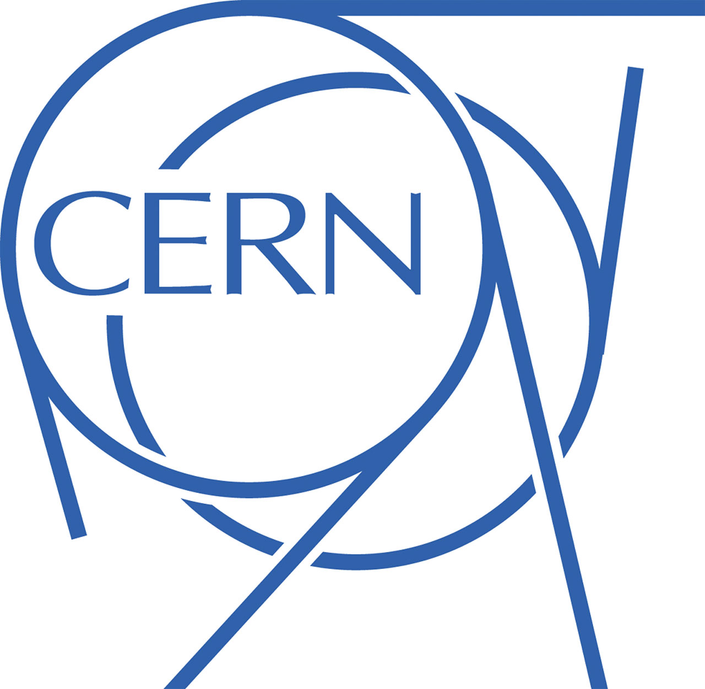
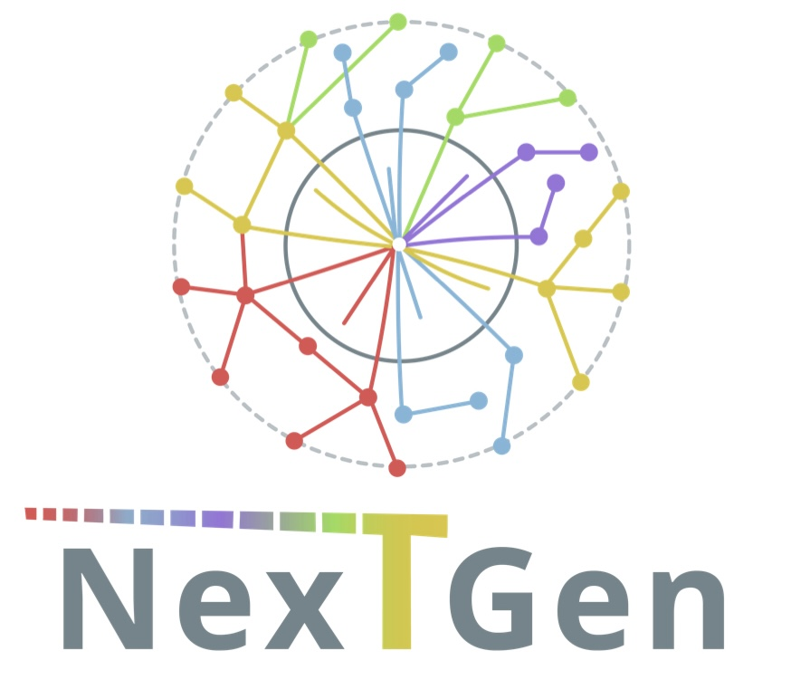

<span>
  
</span>
<span>
  
</span>
<span>
  
</span>
<span>
  
</span>


# Training Jet Taggers for CMS Phase 2 L1 Trigger

Documentation for training a L1T Jet Tagging model for CMS Phase-2 L1 upgrades.

To train the jet tagger, there are multiple steps that one need to follow, from creating the raw datasets, preprocessing them, train the model, synthesize it, and make validation plots for different physics seeds. This README describes all the steps in a sequential manner.

The CI in this repository aims at building a pipeline that enables running all of these steps automatically. The CI artifacts are saved here: https://cms-l1t-jet-tagger.web.cern.ch/

**A summary menu of all the steps is listed below**:

[1. Produce Raw Training Datasets](#1-produce-raw-training-dataset)

[2. Prepare the data and train the model](#2-prepare-the-data-and-train-the-model)

[3. Physics Validation](#3-physics-validation)

[4. Synthesize the model (with wrapper and CMSSW)](#4-synthesize-the-model-to-hdl-codes)

[5. Implement the model in FPGA Firmware](#5-implement-model-on-fpga-firmware)

Note that the instructions are assuming that you have access to the appropriate `eos` data spaces. If you are not interested in reading lengthy documentation like me, here is a ultra-short version to get started on running the code (more details in each specific command is provided in each section above, futher help can be found by looking into each script):

```
#Everything is done directly under the TrainTagger directory

#Activate the environment
conda activate tagger

#Run this to add the scripts in this directory to your python path
source setup.sh

#Prepare the data
python tagger/train/train.py --make-data

#Train the model
python tagger/train/train.py

#Make some basic validation plots
python tagger/train/train.py --plot-basic

#Make other plots for bbbb/di-taus final state for example:
python bbbb.py --deriveWPs
python bbbb.py --eff

#Or for di-taus
python tagger/plot/diTaus.py --deriveWPs
python tagger/plot/diTaus.py --BkgRate
python tagger/plot/diTaus.py --eff

#Synthesize the model (with wrapper and CMMSSW)
python tagger/firmware/hls4ml_convert.py
```

# 1. Produce Raw Training Dataset
  
  Creating the training datasets involve several steps: 
  
  1. Taking the RAW samples and pruning/sliming them. This can be done running the `runInputs_X_X.py` scripts in [FastPUPPI](https://github.com/CMS-L1T-Jet-Tagging/FastPUPPI/tree/dev/14_0_X-leptons), which also uses [submission](https://github.com/CMS-L1T-Jet-Tagging/submission) repo. This is currently done for all, and stored in here:
  
  ```
  /eos/cms/store/cmst3/group/l1tr/FastPUPPI/14_0_X/fpinputs_131X/v9a/
  ```
  
  2. These samples will then be processed by the nTuplizer, which is part of the [FastPUPPI](https://github.com/CMS-L1T-Jet-Tagging/FastPUPPI/tree/dev/14_0_X-leptons) repo. In particular the `runPerformanceNTuple.py`, which calls `jetNTuplizer.cc`. Note that to submit jobs as part of this setup, you also need the [submission](https://github.com/CMS-L1T-Jet-Tagging/submission/tree/dev/14_0_X-leptons) repo as well. 

# 2. Prepare the data and train the model

After creating the training ntuples, in our setup, they will then be shuffled and concatenate (`hadd`) into a big file, such as this one:

```
/eos/cms/store/cmst3/group/l1tr/sewuchte/l1teg/fp_ntuples_v131Xv9/baselineTRK_4param_021024/All200.root
```

We use one of the scripts in this respository to prepare the training data. First, you have to set up the conda environment and set up the appropriate paths for the scripts:

```
#Create the environment from the yaml file
conda-env create -f environment.yml

#Activate the environment
conda activate tagger

#Run this to add the scripts in this directory to your python path
source setup.sh
```


Then, to prepare the data for training:

```
python tagger/train/train.py --make-data 
```

This prepare the data using the default options(look into the script to see what the options are). If you want to customize the input data path, or the data step size for `uproot.iterate`, then you can use the full options

```
python tagger/train/train.py --make-data -i <your-rootfile> -s <custom-step-size>
```

This automatically create a new directory: `training_data` (it will ask before removing the exisiting one), and writes the data into it. Then, to train the model:

```
python tagger/train/train.py
```

The models are defined in `tagger/train/models.py` the `baseline` model is provided as default.

# 3. Physics Validation

Various physics validation plots can be make using the `tagger/plot` modules, the plots are divided into different final states, such as `bbbb.py`, to use the script, you need to derive the working points before evaluating the background rate/efficiency.

```
python tagger/plot/bbbb.py --deriveWPs -n <number of samples to use, usually ~1M>
```

then, evaluate the efficiency using:

```
python tagger/plot/bbbb.py --eff -n <number of samples to use, usually ~500k>
```

# 4. Synthesize the model to HDL Codes

To synthesize the model into HDL codes, we first need use `hls4ml`:

```
python tagger/firmware/hls4ml_convert.py
```

Then, these codes are synthesize again with an hls wrapper, and CMSSW:


# 5. Implement model on FPGA firmware

------
## Conda Environment Notes

To deactivate the environment:

```
conda deactivate
```

If you make any update for the environment, please edit the `environment.yml` file and run:

```
conda env update --file environment.yml  --prune
```

Reference on conda environment here: https://docs.conda.io/projects/conda/en/latest/user-guide/tasks/manage-environments.html

# Continous Integration

All branches of this repo have a continous integration (CI) pipeline associated with them. These are hosted on a [gitlab](https://gitlab.cern.ch/ml_l1/TrainTagger) mirror. Contact cebrown@cern.ch for access.

Relevant variables for pipelines are found in ```.gitlab-ci.yml``` and are set as environment variables within the pipeline. For example the pipeline will use ```${Name}``` which expands to ```new_samples_baseline_5param_extended_trk``` when evaluated. The CI steps are essentially bash scripts.

All artefacts are uploaded to [this](https://cms-l1t-jet-tagger.web.cern.ch/TrainTagger/) website for viewing. With the structure ```branches/my-branch/name/pipeline/plots|model|firmware```

The CI will carry out dataset creation, training, evaluation, model synthesis, emulation, and uploading of all artefacts to a website for viewing. The stages are as follows, with some additional notes about each stage.
 
- **data**: creates the training data. This step is repeated for all new branches and needs to be manually triggered. It will use data ```${EOS_DATA_DIR}/${TRAIN}``` and save its output to ```${EOS_STORAGE_DIR}/${EOS_STORAGE_DATADIR}```

  Once it has been completed once it will not run again unless changes are made to the ```tagger/data``` directory
- **train**: runs the training of a new model and some basic plotting scripts. The training runs on the data steps output and the plotting will run on a test set of this. There is also the option of doing signal specific ROC curves. The signal for this is specified by the ```${SINAL}``` CI variable. These output plots are found in the ```plots/training``` website area.
  
  If you are not wanting to train the model and just look at plotting and firmware developments there is an option to run this training step to just produce the basic plots and to run the entire rest of the pipeline on the current in production CMSSW model. This is controlled by the ```${RERUN_ON_TAG}``` variable, set it to ```'True'``` if you want to run on the ```${TAG}``` model. The output of the pipeline will no longer be in a seperate branch area of the website and will instead be uploaded [here](https://cms-l1t-jet-tagger.web.cern.ch/TrainTagger/tags/v0.0.0/test/).

- **evaluate**: runs physics plotting including bb $\tau \tau$, VBF $\tau \tau$, Toplogy $\tau \tau$ and bbbb performance. 

- **hls4ml**: runs the hls4ml conversion, this is a python only (no vivado) building of the project

- **synth**: runs the vitis hls build and vivado synthesis of the project

- **emulate**: runs the CMSSW emulation of the model using the output of the hls4ml build project step. This step uses the ```${CMSSW_VERSION}``` and ```${CMSSW_L1CT}``` fork:branch of CMSSW. It will insert the project that the previous step makes within the ```${CMSSW_EMULATOR_WRAPPER}``` If you change the model architecture or the model input and output quantisation you will need to make a new CMSSW emulator wrapper and potentially a new CMSSW branch for your model to pass the CI.

- **emulation-evaluate**: compares the tensorflow, hls4ml built and CMSSW emulator models in a test set of events.

- **profile**: runs a layer by layer evaluation of the hls4ml model to find potential places where precision is lost. Also prints out the resource usage of the model.

- **upload_tagged_model** and **upload_new_model**: upload artefacts of the CI to the website. If you add additional artefact folders this step will need to be adapted to include your new folders. 


## Related Materials

Related talks and materials to the project can be found here, they are ordered chronologically. 

* [Level-1 Phase-2 Jet Tagging, 9 Jul 2024, Experience in jet tagger firmware integration](https://indico.cern.ch/event/1435130/)
* [Tau-Jets-MET, 7 May 2024, Jet tagging @ Phase-2 correlator layer](https://indico.cern.ch/event/1413293/#28-phase-2-jet-tagging)

